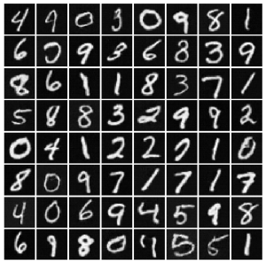
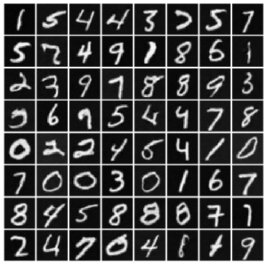

<h1 align="center">
  Adversarial Latent Autoencoders, ALAE with TF2
   
</h1>
  

    <a href="https://tostcorp.com/">Frédéric TOST</a>    
  

<h4 align="center">MNIST dataset, ConvNet implementation with Tensorflow 2</h4>

Generated images

&nbsp;&nbsp;&nbsp;

# ALAE

## Content

This is a Python/Tensorflow 2.0 implementation of the **A**dversarial **L**atent **A**uto**E**ncoders. 
See reference below: 
* Stanislav Pidhorskyi, Donald A. Adjeroh, and Gianfranco Doretto. Adversarial Latent Autoencoders. In *Proceedings of the IEEE Computer Society Conference on Computer Vision and Pattern Recognition (CVPR)*, 2020. [to appear] 
>

<h5 align="center">preprint on arXiv: <a href="https://arxiv.org/abs/2004.04467">2004.04467</a></h5>

**MNIST** dataset is used as a toy example. The **Generator** and **E encoder** are using **Conv2D** and **Conv2DTranspose** instead of a **MLP** (Multi-Layer Perceptron used in the paper). 
This gives better results but  a longer training.

## Objective

Show how to easily implement the ALAE with the MNIST dataset and Convolutional Networks. Finding the hyperparameters such as learning rate of each optimizer is the most fastidious task.

## To run the demo

To run the demo, you will need to have installed Tensorflow 2.0.0 or more recent (2.1.0, 2.2.0). 

Run the demo

    python alae_tf2.py

#### Repository structure

| Path | Description
| :--- | :----------
| alae_tf2.py | Configure the hyperparameters and run the demo.
| alae_tf2_helper.py | Train the neural network. alae_helper is the class that define the losses and the train step function.
| alae_tf2_models.py | Models used in the demo, Encoders F & E, Generator and Discriminator (4 classes).
| utils.py | Useful functions to process and plot images (2 functions).
